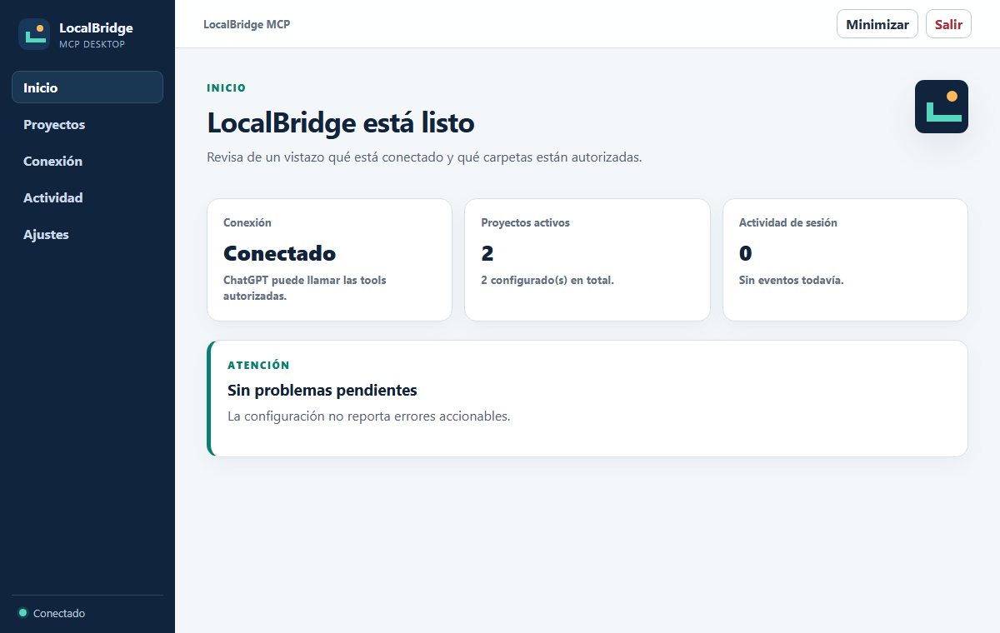
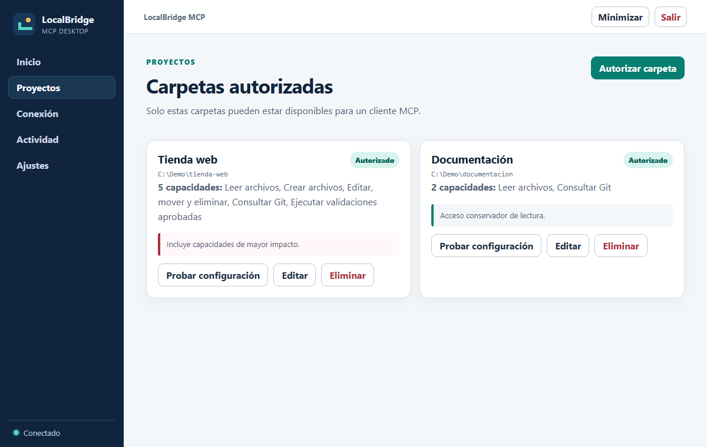
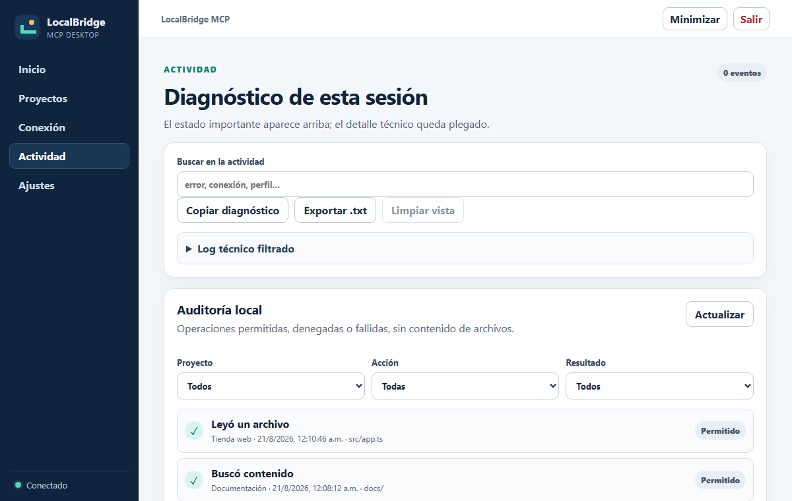

# LocalBridge MCP

Aplicación de escritorio para conectar ChatGPT con proyectos locales de Windows de forma
explícita, auditable y revocable.

**Versión actual:** `v1.1.0` · **Plataforma:** Windows x64 · **Estado:** preview ·
**Licencia:** `UNLICENSED`

[Descargar la preview](https://github.com/VKevinxz/LocalBridge/releases/tag/preview-v1.1.0.1) ·
[Repositorio oficial](https://github.com/VKevinxz/LocalBridge) ·
[Instalación](docs/GETTING_STARTED.md) ·
[Avisos de Windows](docs/WINDOWS_INSTALLATION.md) ·
[Guía de uso](docs/USER_GUIDE.md) ·
[Seguridad](SECURITY.md) ·
[Solución de problemas](docs/TROUBLESHOOTING.md)

> LocalBridge puede leer, modificar y ejecutar código únicamente de acuerdo con el nivel
> de confianza elegido. **Control total del equipo** tiene la autoridad de tu cuenta de
> Windows y no convierte la carpeta seleccionada en un sandbox.

## Qué es

LocalBridge funciona como un puente local entre un cliente MCP autorizado y tus proyectos.
La aplicación permite elegir una carpeta raíz, revisar qué capacidades tendrá el cliente y
revocar el acceso cuando quieras. Una sola carpeta puede contener un frontend, un backend,
un monorepo o varios repositorios y servicios.

Entre sus capacidades se encuentran:

- explorar, buscar, leer y modificar archivos autorizados;
- consultar Git y preparar `stage`, `commit` y `push` con aprobación humana;
- ejecutar validaciones y servicios aprobados, consultar logs y detener procesos;
- detectar puertos pertenecientes a procesos administrados;
- navegar e inspeccionar aplicaciones web locales;
- permitir intervención humana temporal para login, archivos y otros pasos privados;
- registrar operaciones sensibles en una auditoría local sin guardar contenido;
- conectar con ChatGPT mediante Secure MCP Tunnel.

## Experiencia project-first

La primera configuración guía seis pasos:

1. explica el límite de confianza;
2. comprueba automáticamente el runtime incluido;
3. diagnostica la conexión con ChatGPT;
4. permite elegir una carpeta una sola vez;
5. configura acceso Guiado o Control total avanzado;
6. revisa y guarda la configuración de forma transaccional.

La detección inicial no instala dependencias, no inicia servicios y no amplía permisos de
proyectos existentes.

## Niveles de confianza

| Nivel | Uso recomendado | Comportamiento |
|---|---|---|
| **Guiado** | Uso cotidiano | Tools cerradas, permisos granulares y acciones verificables |
| **Agente en proyecto** | No disponible actualmente | Falla cerrado hasta disponer de un sandbox de SO demostrado |
| **Control total del equipo** | Desarrollo avanzado | Terminal con la autoridad real de la cuenta Windows y consentimiento local |

`git.commit` y `git.push` conservan aprobación protegida. El navegador y los procesos se
vinculan a referencias opacas y listeners cuya propiedad vuelve a comprobar LocalBridge.

## Vista previa



<details>
<summary>Más capturas</summary>





</details>

## Instalación rápida

1. Abre [Releases](https://github.com/VKevinxz/LocalBridge/releases) y elige la preview
   indicada en la documentación de descargas.
2. Descarga el instalador de Windows y `SHA256SUMS.txt` de la misma versión.
3. Verifica el hash. Las versiones estables exigen firma digital; el prerelease de
   evaluación actual está identificado expresamente como **sin firma**.
4. Completa el asistente y selecciona una carpeta de prueba.
5. Registra el conector MCP en ChatGPT siguiendo la guía mostrada por la aplicación.

El instalador oficial incluye Electron, Node.js, el servidor MCP, `tunnel-client` y sus
componentes auxiliares. El usuario final no necesita instalar Node ni clonar este
repositorio.

Consulta [Descargas y verificación](docs/DOWNLOADS.md) y la
[Guía de cinco minutos](docs/GETTING_STARTED.md) antes de instalar.

Si estás evaluando un candidato local todavía no firmado, consulta
[Instalación segura en Windows](docs/WINDOWS_INSTALLATION.md). No desactives Defender,
SmartScreen ni Smart App Control para instalar LocalBridge.

## Seguridad y privacidad

LocalBridge aplica estas reglas por construcción:

- las tools MCP reciben IDs opacos y rutas relativas, nunca una raíz arbitraria;
- toda capacidad empieza denegada y necesita autorización local;
- reemplazar un archivo exige verificar inmediatamente su SHA-256 esperado;
- las entradas MCP se validan con schemas estrictos;
- las operaciones sensibles dejan evidencia de auditoría;
- claves y rutas locales no se incluyen en exportaciones portables;
- revocar un proyecto detiene terminales, procesos y navegadores relacionados.

Lee el [modelo público de seguridad](docs/SECURITY_MODEL.md), la
[política de privacidad](docs/PRIVACY_AND_TRUST.md) y el
[proceso de reporte privado](SECURITY.md).

## Documentación

| Documento | Contenido |
|---|---|
| [GETTING_STARTED.md](docs/GETTING_STARTED.md) | Instalación y primera conexión |
| [USER_GUIDE.md](docs/USER_GUIDE.md) | Proyectos, permisos, servicios, navegador y Git |
| [DOWNLOADS.md](docs/DOWNLOADS.md) | Versiones, hashes y verificación |
| [WINDOWS_INSTALLATION.md](docs/WINDOWS_INSTALLATION.md) | SmartScreen, firma y candidatos no firmados |
| [ARCHITECTURE.md](docs/ARCHITECTURE.md) | Arquitectura técnica resumida |
| [DESIGN_PRINCIPLES.md](docs/DESIGN_PRINCIPLES.md) | Decisiones de diseño públicas y curadas |
| [SECURITY_MODEL.md](docs/SECURITY_MODEL.md) | Fronteras, confianza y mitigaciones |
| [PRIVACY_AND_TRUST.md](docs/PRIVACY_AND_TRUST.md) | Datos locales, túnel y revocación |
| [OPERATIONS.md](docs/OPERATIONS.md) | Actualización, respaldo y desinstalación |
| [TROUBLESHOOTING.md](docs/TROUBLESHOOTING.md) | Problemas frecuentes |
| [TOOL_CATALOG.md](docs/TOOL_CATALOG.md) | Referencia de tools MCP |
| [GITHUB_PUBLISHING.md](docs/GITHUB_PUBLISHING.md) | Crear el repositorio y publicar releases |
| [CHANGELOG.md](CHANGELOG.md) | Historial resumido de versiones |

## Desarrollo

Requisitos: Node.js 22, pnpm 9.12 y Windows x64 para probar o empaquetar el escritorio.

```powershell
pnpm install --frozen-lockfile
pnpm build:native:test
pnpm lint
pnpm typecheck
pnpm test
pnpm test:sec
pnpm --filter @localbridge/desktop build
```

Para ejecutar la aplicación en desarrollo:

```powershell
pnpm --filter @localbridge/desktop dev
```

Consulta [CONTRIBUTING.md](CONTRIBUTING.md) antes de abrir una incidencia. Actualmente no
se aceptan contribuciones externas de código.

## Soporte y publicación

- Problemas de uso: [SUPPORT.md](SUPPORT.md).
- Bugs reproducibles: usa el formulario de incidencias del repositorio.
- Vulnerabilidades: sigue [SECURITY.md](SECURITY.md), nunca una incidencia pública.
- Los binarios se publican exclusivamente mediante GitHub Releases; no forman parte del
  historial Git.

## Copyright

Copyright © 2026 VKevinXZ. Este repositorio se publica sin licencia open source y sus
paquetes declaran `UNLICENSED`. Puedes ver y analizar el código; no se concede permiso para
modificarlo, redistribuirlo ni crear derivados. Los binarios oficiales sin modificar pueden
descargarse y ejecutarse para evaluación y uso personal. Consulta
[COPYRIGHT.md](COPYRIGHT.md).

LocalBridge se distribuye actualmente como preview. Revisa el aviso de derechos y las notas
de cada release antes de usarlo en entornos críticos.
